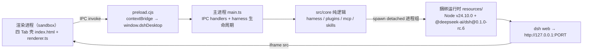

# DSH Desktop Hub


DSH Desktop Hub — DeepSeek Harness 桌面管理控制台（Electron + TypeScript）。

双击启动即进入 DSH harness 对话界面，无需安装 Node.js / pnpm 等任何运行环境（打包内置 Node v24.10.0 + `@deepseek-ai/dsh@0.1.0-rc.6`）；内置多 Tab 管理系统：**Harness（官方 Web UI）/ Plugin / MCP / Skills**。

## 功能

- **Harness Tab（主）**：`<iframe>` 内嵌官方 Web UI（`dsh web` 启动于 `http://127.0.0.1:PORT`）；主进程通过 `did-frame-navigate` 检测子帧导航并推送 `harness:frame-loaded`，状态条显示「harness 已连接: 127.0.0.1:PORT」。
- **Plugin Tab**：读取 profile「web」的插件清单（`dsh.profile.bundles` ∪ `dependencies`，分类为内置组合包 / 第三方组合包 / 普通依赖）；安装 / 移除 / 更新真实执行 `dsh plugin --profile web add|remove|update`（写操作前确认，变更后提示重启 harness 生效）；对没有 `package.json/dsh.bundle` 的聚合仓库拒绝直接安装，避免把仓库根目录误装成插件。
- **MCP Tab**：粘贴 Claude Code / Cursor 风格 MCP JSON → 转换预览（DSH `@deepseek-ai/dsh-mcp-client` 插件行 YAML，含 sse / 非法 serverName 警告）→ 确认后写入 profile「web」的 `cordis.patch.yml`；列出已写入服务器，支持编辑 / 删除；所有写操作原子落盘并创建 `.bak-<ts>` 备份，官方 HMR 热生效。
- **Skills Tab**：按 DSH rank 规则扫描（项目 `.dsh`/`.agents` → 用户 `~/.dsh/skills`/`~/.agents/skills` → bundled，rank 100-600）；同名低 rank 生效、高 rank 标「被遮蔽」；导入 `.skill` / `.zip` 文件或 GitHub 链接（`https://github.com/owner/repo[/tree/<branch>/<path>]`）到 `~/.dsh/skills`（自动剥离 zip 包裹目录、保留 SKILL.md 与资源文件）；新建用户级 skill（kebab-case 名称校验 + frontmatter 组装，落盘 `~/.dsh/skills/<name>/SKILL.md`）；模型可见 / 用户可见切换（写 `disable-model-invocation` / `user-invocable`），改动即时生效。

## 架构

```
渲染进程（sandbox）             preload                   主进程                    核心逻辑                   捆绑运行时
┌──────────────────┐   ┌──────────────────┐   ┌────────────────────┐   ┌──────────────────┐   ┌─────────────────────────┐
│ 四 Tab 壳         │   │ window.dshDesktop│   │ IPC handlers       │   │ src/core/         │   │ resources/              │
│ index.html       │──▶│ contextBridge    │──▶│ harness:url         │──▶│ harness.ts        │──▶│ node/（Node v24.10.0）   │
│ renderer.ts      │   │ preload.cjs      │   │ plugins:list/       │   │ plugins.ts        │   │ dsh-runtime/            │
│ (harness iframe) │◀──│ (CJS, sandbox)   │◀──│   install/remove/    │   │ mcp.ts            │   │  @deepseek-ai/dsh       │
│                  │   │                  │   │   update             │   │ skills.ts         │   │  (0.1.0-rc.6)           │
│                  │   │                  │   │ mcp:list/convert/    │   └──────────────────┘   │        │                │
│                  │   │                  │   │   apply/update/     │            │ spawn(detached) ▼                │
│                  │   │                  │   │   delete             │            └──── dsh web --port 0 ─────┘                │
│                  │   │                  │   │ skills:list/create/  │                          │                                │
│                  │◀──│ harness:frame-   │   │   toggle             │                          │                                │
│                  │   │   loaded 推送     │   │ harness:frame-loaded │                    http://127.0.0.1:PORT                  │
└──────────────────┘   └──────────────────┘   └────────────────────┘                          └─────────────────────────────────┘
```



生命周期：

```
启动 → registerIpc() → resolveDshExec()（打包内 runtime 优先，回退 PATH）
  → spawn dsh web --port 0（独立进程组）→ 解析 127.0.0.1:PORT → 轮询 HTTP 200（就绪超时 120s）
  → BrowserWindow（1280×800，sandbox + contextIsolation + preload.cjs）
  → 加载四 Tab 壳（file://dist/renderer/index.html）
  → renderer 经 IPC 取 harness URL → iframe 挂载官方 Web UI
退出 → will-quit → harness.stop()：SIGTERM 进程组 → 2s 兜底 SIGKILL → app.quit
```

- 默认（无 flag）＝产品行为：启动 harness + 四 Tab 壳；主菜单仅「退出 / 全屏」。
- 冒烟模式：`--smoke`（不启 harness，DOM + 真实数据断言）；`--harness-smoke`（真实 harness + iframe 加载断言）。

## 目录结构

```
dsh-desktop/
├── src/
│   ├── main/main.ts            # Electron 主进程：窗口 + IPC + harness 进程生命周期
│   ├── preload/preload.ts      # contextBridge 白名单 API（sandbox，编译为 preload.cjs）
│   ├── renderer/               # 四 Tab 壳：index.html + renderer.ts（纯脚本，无模块）
│   └── core/                   # 纯逻辑（可单测）：harness.ts / plugins.ts / mcp.ts / skills.ts
├── tests/                      # node --test 单测 ×33（从 dist/ 导入，需先 build）
├── scripts/
│   ├── build-preload.mjs       # preload 以 CJS 编译并重命名为 .cjs
│   ├── copy-renderer.mjs       # 拷贝 index.html → dist/renderer
│   ├── bundle-runtime.mjs      # 下载 Node + npm 安装 dsh 到 resources/
│   ├── verify.mjs              # 一键门禁：契约 + 构建 + typecheck×2 + 单测
│   └── verify-m1.mjs           # M1 实机验证：dsh web 启动 → HTTP 200 → 优雅停止
├── resources/                  # 捆绑运行时（gitignore）：node/ + dsh-runtime/（约 586MB）
├── release/                    # electron-builder 产物（gitignore）：DMG arm64
├── artifacts/                  # 冒烟截屏（gitignore）
├── dist/                       # tsc 产物（gitignore）
├── tsconfig.json               # 主进程 + core + preload（NodeNext，outDir dist）
├── tsconfig.preload.json       # preload：CommonJS → dist/preload/preload.cjs
├── tsconfig.renderer.json      # renderer：纯脚本 → dist/renderer
├── electron-builder.yml        # appId com.dshdesktop.app；DMG arm64；asarUnpack resources
└── package.json
```

## 开发命令

| 命令 | 说明 |
|---|---|
| `npm install` | 安装依赖（electron / typescript / electron-builder / yaml） |
| `npm run build` | 三套 tsc（main+core → preload CJS → renderer）+ 拷贝 index.html，产物 `dist/` |
| `npm run typecheck` | `tsc --noEmit`（main + core + preload；renderer 类型检查含在 `verify` 中） |
| `npm test` | `node --test "tests/*.test.mjs"` 单测（**需先 build**，测试从 dist 导入） |
| `npm start` | 产品模式：启动 harness + 四 Tab 壳（需 dsh 可用且 `~/.dsh` 存在 web profile） |
| `npm run smoke` | 骨架冒烟（不启 harness）：四 Tab DOM + 真实插件/MCP/skills 数据断言，截屏 `artifacts/m0-smoke.png` |
| `npm run smoke:harness` | 真实 harness 冒烟：iframe 挂载 + 状态「已连接」，截屏 `artifacts/m1-harness.png` |
| `npm run verify:m1` | M1 实机验证：真实启动 dsh web → HTTP 200 → 优雅停止 → 端口关闭无孤儿 |
| `npm run verify` | 一键门禁：骨架契约 + 构建产物 + typecheck×2 + 单测全绿 |

## 打包命令

```sh
npm run build                          # 1. 构建 dist/
node scripts/bundle-runtime.mjs        # 2. 捆绑运行时（首次/更新）：下载 Node v24.10.0 +
                                      #    安装 @deepseek-ai/dsh@0.1.0-rc.6 到 resources/
npx electron-builder                   # 3. 读 electron-builder.yml → release/DSH-Desktop-0.1.0-arm64.dmg
```

- `bundle-runtime.mjs`：下载官方 Node v24.10.0（darwin/linux × arm64/x64）到 `resources/node`，用捆绑 npm 以 `--ignore-scripts` 安装锁定版本 `@deepseek-ai/dsh@0.1.0-rc.6` 到 `resources/dsh-runtime`。
- `electron-builder.yml`：`files` 含 `dist/**/*` + `resources/**/*`；`asarUnpack` 展开 `resources/dsh-runtime` 与 `resources/node`（`resolveDshExec` 兼容 `app.asar.unpacked/resources` 布局）；mac 目标 DMG（arm64），`identity: null`（不签名）。
- 打包后的应用在 PATH 仅 `/usr/bin:/bin`（无系统 node/dsh）的环境下可用捆绑运行时启动。

## Release

推送 `v*` tag 后，GitHub Actions 会自动完成：

1. `npm ci` 安装依赖
2. `npm run verify`：类型检查 + 构建 + 测试
3. `node scripts/bundle-runtime.mjs`：生成捆绑运行时（Node + DSH）
4. `npx electron-builder --mac dmg`：打包 macOS arm64 DMG
5. 创建 GitHub Release 并上传 `.dmg` / `.dmg.blockmap`

```sh
git push origin main
git tag v0.1.0
git push origin v0.1.0
```

> 当前仓库 `resources/` 已被 `.gitignore` 忽略；CI 会通过 `bundle-runtime.mjs` 在打包时重新生成，不需要把大文件提交进仓库。

## 验证基线

| 层级 | 内容 |
|---|---|
| 契约测试 `tests/skeleton.test.mjs`（5 例） | 骨架文件齐全；package.json 脚本与 devDependencies；四 Tab 契约；contextIsolation + sandbox + nodeIntegration:false；tsconfig strict |
| Harness `tests/harness.test.mjs`（5 例） | `findDsh` 可解析；`dshHome` 默认/覆盖；真实 web profile 发现（首个 bundle = dsh-base）；忽略非 profile 目录；`parseHarnessUrl` |
| Plugin `tests/plugins.test.mjs`（6 例） | bundles ∪ dependencies 分类；排序稳定；`buildPluginCommand` 命令形态；`normalizeInstallSpec` GitHub 链接归一化；聚合仓库识别/拦截；`runPluginOp` 退出码 + 取消 |
| MCP `tests/mcp.test.mjs`（11 例） | 混合 stdio+http 解析；sse / 非法 serverName 警告；格式拒绝；YAML 与官方示例同构；`${VAR}` → `!!js process.env.VAR`；patch 提取 / 替换 / 编辑 / 删除保留注释；空 patch 新建 / 备份事务 |
| Skills `tests/skills.test.mjs`（7 例） | rank 合并 + shadowed；frontmatter 往返一致；kebab-case 校验落盘；可见性切换；zip/.skill 导入（含资源文件、包裹目录剥离、拒绝无 SKILL.md）；GitHub URL 解析 |
| `npm run smoke` | 四 Tab 就绪；真实 web profile 插件 ≥4 含 dsh-base；MCP 转换端到端（preview 含 `dsh-mcp-client` / `streamable-http`）；真实 skills（huashu-design + media-use） |
| `npm run smoke:harness` | harness 就绪；iframe 挂载 `http://127.0.0.1:PORT`；状态「已连接」 |
| `npm run verify:m1` | 真实 dsh web 启动并 HTTP 200（页面 ≥100B）；优雅停止后端口关闭、无孤儿进程 |

## 已知限制

- **profile 固定**：`ACTIVE_PROFILE` 常量 = `'web'`（main.ts 注释：M5 将支持切换），暂无 UI 切换。
- **Routing Suite 聚合仓库**：`https://github.com/yjh051108/dsh-routing-suite` 不是单一 DSH bundle，根目录缺 `package.json/dsh.bundle`；Plugin Tab 会拒绝直接安装。应按仓库说明分别装配 injector、router-standard preset 与可选 mode-boost。
- **无 Settings / 第四系统**：Settings（API Key / 模型 / 更新）与第四系统占位本期未实现，API Key/模型配置请使用官方 Web UI 内能力。
- **MCP 无文件导入**：MCP 面板仅支持粘贴 JSON（`${VAR}` 自动转 `!!js process.env.VAR`），暂无 `.mcp.json` 文件选择器。
- **退出边界**：正常退出走 SIGTERM 进程组清理；强杀（timeout / group-kill）可能遗留 dsh 子进程。
- **打包范围**：仅 macOS DMG（arm64），未签名（`identity: null`）；Windows / Linux 打包待做；应用图标为 Electron 默认；无自动更新。
- **体积**：`resources/` 捆绑运行时约 586MB（gitignore），首包体积较大。
- **写操作落真实 profile**：MCP「写入 patch」真实修改 `~/.dsh/profiles/web/cordis.patch.yml`（写入前自动 `.bak-<ts>` 备份）；插件安装/移除真实执行 `dsh plugin`。
